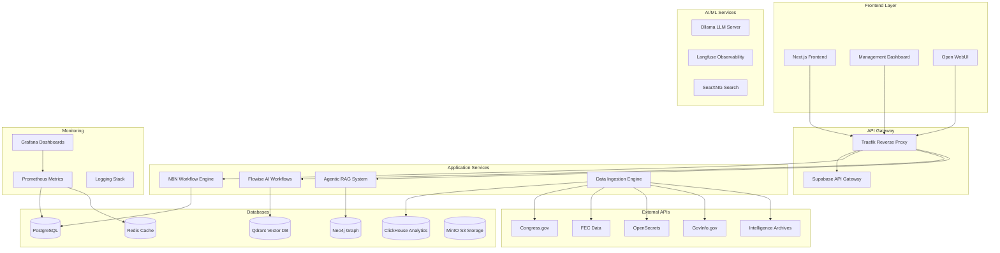

# Local AI Package - Complete Government Data Analysis Platform

A comprehensive, self-hosted AI platform for analyzing government data, tracking political activities, and generating insights from federal, state, and local sources including declassified intelligence documents.

## 🚀 Quick Start

```bash
# 1. Clone and setup
git clone <repository-url>
cd local-ai-packaged

# 2. Generate secure secrets
./scripts/generate-secrets.sh

# 3. Launch all services (idempotent)
./scripts/start-all-services.sh

# 4. Check system health
./scripts/health-check.sh

# 5. Access the platform
# Frontend: http://localhost:3000
# Dashboard: http://localhost:3006
# N8N Workflows: http://localhost:5678
```

## 📋 Table of Contents

- [Features](#-features)
- [Architecture](#-architecture)
- [Prerequisites](#-prerequisites)
- [Installation](#-installation)
- [Configuration](#-configuration)
- [Usage](#-usage)
- [Data Sources](#-data-sources)
- [AI & Analysis](#-ai--analysis)
- [API Documentation](#-api-documentation)
- [Monitoring](#-monitoring)
- [Backup & Recovery](#-backup--recovery)
- [Security](#-security)
- [Troubleshooting](#-troubleshooting)
- [Contributing](#-contributing)

## ✨ Features

### 🏛️ Government Data Ingestion
- **200+ Data Sources**: Federal, state, local government APIs
- **Intelligence Documents**: CIA, FBI, NSA, DARPA declassified materials
- **Political Tracking**: Voting records, campaign finance, lobbying data
- **Real-time Updates**: Automated data synchronization
- **Historical Analysis**: 30+ years of government data

### 🤖 AI-Powered Analysis
- **Politician Profiling**: Comprehensive KPI tracking and metrics
- **Voting Prediction**: ML models for legislative outcome forecasting
- **Document Analysis**: NLP processing of government documents
- **Trend Detection**: Pattern recognition in political behavior
- **Semantic Search**: Vector-based document retrieval

### 🏗️ Infrastructure
- **Docker-based**: Complete containerized deployment
- **Microservices**: Scalable, modular architecture
- **Multiple Databases**: PostgreSQL, Neo4j, Qdrant, ClickHouse, Redis
- **Monitoring Stack**: Grafana, Prometheus, comprehensive logging
- **Backup System**: Automated data protection and recovery

### 🔐 Security & Compliance
- **Secrets Management**: Cryptographically secure configuration
- **Environment Isolation**: Private development vs public production
- **Access Control**: Role-based authentication and authorization
- **Data Protection**: Encryption at rest and in transit
- **Audit Logging**: Comprehensive activity tracking

## 🏗️ Architecture



## 📋 Prerequisites

### System Requirements
- **OS**: Linux, macOS, or Windows with WSL2
- **Memory**: 8GB RAM minimum, 16GB recommended
- **Storage**: 20GB free space minimum
- **CPU**: 4 cores minimum, 8 cores recommended

### Software Dependencies
- **Docker**: 20.10+ with Docker Compose
- **Python**: 3.10+ (managed by uv)
- **Git**: For repository management
- **curl**: For health checks and API testing

### Optional (for GPU acceleration)
- **NVIDIA GPU**: CUDA 11.8+ drivers
- **AMD GPU**: ROCm drivers

## 🛠️ Installation

### 1. System Preparation

```bash
# Ubuntu/Debian
sudo apt update
sudo apt install -y docker.io docker-compose git curl python3 python3-pip

# Enable Docker for current user
sudo usermod -aG docker $USER
newgrp docker

# macOS (with Homebrew)
brew install docker docker-compose git curl python

# Start Docker Desktop on macOS/Windows
```

### 2. Repository Setup

```bash
# Clone repository
git clone <repository-url>
cd local-ai-packaged

# Install Python dependencies
pip install uv
uv sync --dev

# Make scripts executable
chmod +x scripts/*.sh
```

### 3. Environment Configuration

```bash
# Generate secure environment configuration
./scripts/generate-secrets.sh

# Review and customize .env file
nano .env

# Set API keys for government data sources
# CONGRESS_GOV_API_KEY=your_api_key
# FEC_API_KEY=your_api_key
# OPENSECRETS_API_KEY=your_api_key
```

### 4. Initial Deployment

```bash
# Check system requirements
./scripts/health-check.sh

# Resolve any port conflicts
./scripts/port-conflict-resolver.sh scan

# Launch all services
./scripts/start-all-services.sh --profile cpu --environment private

# Wait for services to initialize (2-3 minutes)
# Verify deployment
./scripts/health-check.sh
```

## ⚙️ Configuration

### Environment Variables

The system uses a comprehensive `.env` file with 100+ configuration options:

```bash
# Core Settings
ENVIRONMENT=private          # private (dev) or public (prod)
DOCKER_PROJECT_NAME=localai

# Database Configuration
POSTGRES_PASSWORD=<generated>
JWT_SECRET=<generated>
REDIS_AUTH=<generated>

# AI Services
N8N_ENCRYPTION_KEY=<generated>
FLOWISE_PASSWORD=<generated>
NEXTAUTH_SECRET=<generated>

# API Keys
CONGRESS_GOV_API_KEY=your_key
FEC_API_KEY=your_key
OPENSECRETS_API_KEY=your_key
OPENAI_API_KEY=your_key
```

### Hardware Profiles

```bash
# CPU-only deployment (default)
./scripts/start-all-services.sh --profile cpu

# NVIDIA GPU acceleration
./scripts/start-all-services.sh --profile gpu-nvidia

# AMD GPU acceleration  
./scripts/start-all-services.sh --profile gpu-amd
```

### Environment Modes

```bash
# Private mode (development)
# - All ports bound to localhost
# - Direct service access
./scripts/start-all-services.sh --environment private

# Public mode (production)
# - Only ports 80/443 exposed
# - Traefik handles routing
./scripts/start-all-services.sh --environment public
```

## 🎯 Usage

### Web Interfaces

| Service | URL | Purpose |
|---------|-----|---------|
| **Frontend** | http://localhost:3000 | Main application interface |
| **Dashboard** | http://localhost:3006 | System management dashboard |
| **N8N** | http://localhost:5678 | Workflow automation |
| **Flowise** | http://localhost:3002 | AI workflow builder |
| **Open WebUI** | http://localhost:8081 | LLM chat interface |
| **Grafana** | http://localhost:3003 | Monitoring dashboards |
| **Supabase Studio** | http://localhost:3001 | Database management |

### Command Line Operations

```bash
# System Management
./scripts/start-all-services.sh         # Start all services
./scripts/health-check.sh               # Check system health
./scripts/port-conflict-resolver.sh     # Resolve port conflicts

# Data Operations
python scripts/government-data-ingestion.py --mode full  # Full data ingestion
python scripts/government-data-ingestion.py --mode congress  # Congress data only

# Backup & Recovery
./scripts/backup-restore.sh backup      # Create full backup
./scripts/backup-restore.sh list        # List available backups
./scripts/backup-restore.sh restore --backup-name backup_20240101

# Maintenance
./scripts/backup-restore.sh cleanup --retention-days 30  # Clean old backups
docker-compose logs -f <service>        # View service logs
docker-compose restart <service>        # Restart specific service
```

## 📊 Data Sources

### Federal Government
- **Congress.gov**: Bills, votes, members, committees
- **GovInfo.gov**: Government documents and publications
- **Federal Register**: Regulations and federal notices
- **FEC**: Campaign finance and election data
- **OpenSecrets**: Lobbying and influence data

### Intelligence & Defense
- **CIA Reading Room**: Declassified intelligence documents
- **FBI Vault**: Declassified FBI files and investigations
- **NSA**: Declassified documents and communications
- **DARPA**: Research and development publications
- **Presidential Libraries**: Historical presidential documents

### State & Local
- **State Legislatures**: All 50 state legislative bodies
- **Governor Offices**: Executive actions and communications
- **Major Cities**: Open data from 100+ metropolitan areas
- **County Governments**: Local governance and policy data

### Research & Analysis
- **Think Tanks**: Brookings, Heritage, AEI, Cato Institute
- **Academic Institutions**: Policy research and analysis
- **Fact-Checking**: PolitiFact, FactCheck.org, Snopes
- **Election Data**: Ballotpedia, Vote411, election results

## 🤖 AI & Analysis

### Document Processing
- **Text Extraction**: PDF, Word, PowerPoint processing
- **OCR**: Scanned document digitization
- **NLP Analysis**: Entity extraction, sentiment analysis
- **Vector Embeddings**: Semantic search and similarity

### Politician Profiling
```python
# Example politician analysis
{
    "politician_id": "bioguide_ABC123",
    "name": "Senator Jane Doe",
    "kpis": {
        "voting_attendance_rate": 0.95,
        "party_loyalty_score": 0.85,
        "bipartisan_score": 0.15,
        "bills_sponsored": 47,
        "committee_influence": 0.78,
        "media_mentions": 1250,
        "legislative_effectiveness": 0.82
    }
}
```

### AI Prompts

The system includes 30+ specialized prompts for:
- **Political Analysis**: Voting patterns, effectiveness scoring
- **Document Analysis**: Declassified document interpretation
- **Trend Prediction**: Legislative outcome forecasting
- **Code Development**: System optimization and enhancement

### ML Models
- **Sentence Transformers**: Document embeddings
- **Voting Prediction**: Decision tree and neural networks
- **Anomaly Detection**: Unusual political behavior identification
- **Time Series**: Trend analysis and forecasting

## 📖 API Documentation

### REST API Endpoints

```bash
# Politician Data
GET /api/politicians              # List all politicians
GET /api/politicians/{id}         # Get politician details
GET /api/politicians/{id}/votes   # Get voting record
GET /api/politicians/{id}/bills   # Get sponsored bills

# Legislative Data
GET /api/bills                    # List bills
GET /api/bills/{id}              # Get bill details
GET /api/votes                   # List votes
GET /api/votes/{id}              # Get vote details

# Analysis
GET /api/analysis/trends          # Get political trends
GET /api/analysis/predictions     # Get predictions
POST /api/analysis/query          # Custom analysis query

# Search
GET /api/search?q={query}         # Semantic search
GET /api/search/politicians?q={query}  # Search politicians
GET /api/search/documents?q={query}    # Search documents
```

### GraphQL API

```graphql
# Example queries
query GetPolitician($id: ID!) {
  politician(id: $id) {
    name
    party
    state
    votingRecord {
      bill {
        title
        summary
      }
      position
      date
    }
    kpis {
      effectivenessScore
      bipartisanScore
      attendanceRate
    }
  }
}

query SearchDocuments($query: String!) {
  searchDocuments(query: $query) {
    documents {
      title
      content
      source
      similarity
    }
  }
}
```

## 📈 Monitoring

### Health Monitoring
- **Service Health**: Automated health checks for all components
- **Performance Metrics**: Response times, throughput, error rates
- **Resource Usage**: CPU, memory, disk, network utilization
- **Custom Alerts**: Configurable alerting for critical issues

### Dashboards

#### System Overview
- Service status and uptime
- Resource utilization trends
- Error rate monitoring
- Performance benchmarks

#### Data Ingestion
- Documents processed per hour
- API rate limiting status
- Data quality metrics
- Ingestion pipeline health

#### AI/ML Performance
- Model inference times
- Prediction accuracy metrics
- Vector database performance
- Search relevance scores

### Logging
- **Structured Logging**: JSON format with correlation IDs
- **Log Aggregation**: Centralized log collection
- **Log Retention**: Configurable retention policies
- **Search & Analysis**: Full-text log search capabilities

## 💾 Backup & Recovery

### Automated Backups

```bash
# Create full backup
./scripts/backup-restore.sh backup

# Scheduled backups (add to crontab)
0 2 * * * /path/to/scripts/backup-restore.sh backup --retention-days 30

# Component-specific backups
./scripts/backup-restore.sh backup --include databases,configs
./scripts/backup-restore.sh backup --exclude logs,models
```

### Backup Components
- **Databases**: PostgreSQL, Redis, Neo4j, ClickHouse
- **Configurations**: Environment files, Docker configs
- **Volumes**: Persistent data and user content
- **Models**: AI models and embeddings
- **Logs**: Application and system logs

### Recovery Procedures

```bash
# List available backups
./scripts/backup-restore.sh list

# Restore from specific backup
./scripts/backup-restore.sh restore --backup-name backup_20240101

# Verify backup integrity
./scripts/backup-restore.sh verify --backup-name backup_20240101

# Disaster recovery
docker-compose down
./scripts/backup-restore.sh restore --backup-name backup_20240101 --force
./scripts/start-all-services.sh
```

## 🔐 Security

### Secrets Management
- **Cryptographically Secure**: All secrets generated with OpenSSL
- **Environment Isolation**: Separate secrets per environment
- **Rotation Support**: Easy secret rotation procedures
- **Backup Protection**: Encrypted backup storage

### Access Control
- **Service Authentication**: Internal service-to-service auth
- **User Management**: Role-based access control
- **API Security**: Rate limiting and authentication
- **Network Security**: Internal network isolation

### Data Protection
- **Encryption at Rest**: Database and file encryption
- **Encryption in Transit**: TLS for all communications
- **Data Anonymization**: PII protection in logs
- **Compliance**: GDPR and privacy law compliance

### Security Monitoring
- **Access Logging**: All access attempts logged
- **Anomaly Detection**: Unusual access pattern alerts
- **Vulnerability Scanning**: Regular security assessments
- **Incident Response**: Automated security incident handling

## 🔧 Troubleshooting

### Common Issues

#### Port Conflicts
```bash
# Identify conflicts
./scripts/port-conflict-resolver.sh scan

# Automatic resolution
./scripts/port-conflict-resolver.sh resolve private

# Manual port checking
netstat -tuln | grep :8080
lsof -i :8080
```

#### Service Startup Issues
```bash
# Check service status
docker-compose ps

# View service logs
docker-compose logs -f <service-name>

# Restart problematic service
docker-compose restart <service-name>

# Force recreation
docker-compose up --force-recreate <service-name>
```

#### Performance Issues
```bash
# Check resource usage
docker stats

# Monitor system resources
htop
iotop
nethogs

# Database performance
docker-compose exec postgres psql -U postgres -c "SELECT * FROM pg_stat_activity;"
```

#### Data Ingestion Issues
```bash
# Check ingestion logs
tail -f logs/ingestion.log

# Test API connectivity
curl -I https://api.congress.gov/v3

# Verify API keys
grep API_KEY .env

# Manual ingestion test
python scripts/government-data-ingestion.py --mode congress --verbose
```

### Performance Optimization

#### Database Tuning
```sql
-- PostgreSQL optimization
ALTER SYSTEM SET shared_buffers = '256MB';
ALTER SYSTEM SET effective_cache_size = '1GB';
ALTER SYSTEM SET maintenance_work_mem = '64MB';
SELECT pg_reload_conf();
```

#### Container Resources
```yaml
# docker-compose.override.yml
services:
  postgres:
    deploy:
      resources:
        limits:
          memory: 1G
          cpus: '2'
        reservations:
          memory: 512M
          cpus: '1'
```

### Log Analysis
```bash
# Error analysis
grep -i error logs/*.log | tail -20

# Performance analysis
grep -i "slow query" logs/postgres.log

# Security analysis
grep -i "unauthorized\|forbidden\|denied" logs/*.log

# API rate limiting
grep -i "rate limit" logs/*.log
```

## 🤝 Contributing

### Development Setup

```bash
# Clone and setup development environment
git clone <repository-url>
cd local-ai-packaged

# Install development dependencies
uv sync --dev

# Install pre-commit hooks
pre-commit install

# Run linting
black scripts/
isort scripts/
flake8 scripts/
mypy scripts/
```

### Code Standards
- **Python**: PEP 8 with Black formatting
- **Documentation**: Comprehensive docstrings
- **Testing**: Unit tests for critical functions
- **Type Hints**: Full type annotation coverage
- **Linting**: Pre-commit hooks for quality

### Pull Request Process
1. Fork the repository
2. Create feature branch: `git checkout -b feature/amazing-feature`
3. Commit changes: `git commit -m 'Add amazing feature'`
4. Push to branch: `git push origin feature/amazing-feature`
5. Open Pull Request with detailed description

### Issue Reporting
- Use issue templates for bug reports and feature requests
- Include system information and reproduction steps
- Attach relevant logs and configuration files
- Label issues appropriately for triage

## 📄 License

This project is licensed under the MIT License - see the [LICENSE](LICENSE) file for details.

## 🙏 Acknowledgments

- **Government Data Providers**: Congress.gov, FEC, OpenSecrets
- **Open Source Projects**: Docker, PostgreSQL, Neo4j, Qdrant
- **AI/ML Frameworks**: Transformers, Sentence Transformers, Ollama
- **Web Technologies**: Next.js, FastAPI, Traefik

## 📞 Support

- **Documentation**: Check docs/ directory for detailed guides
- **Issues**: GitHub Issues for bug reports and feature requests
- **Discussions**: GitHub Discussions for questions and community
- **Security**: See SECURITY.md for security-related issues

---

**Local AI Package** - Empowering democratic transparency through advanced AI analysis of government data.