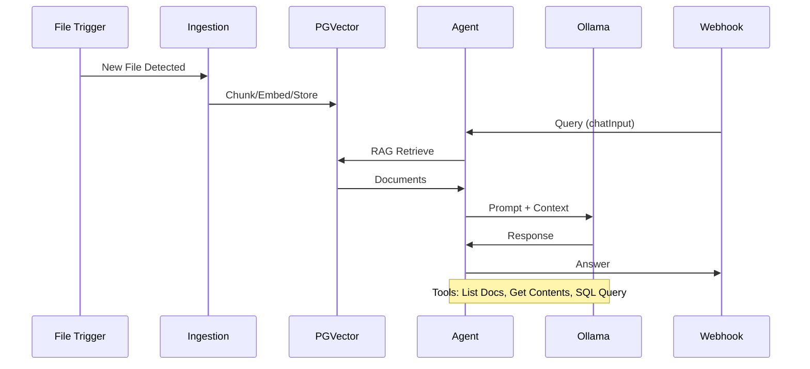
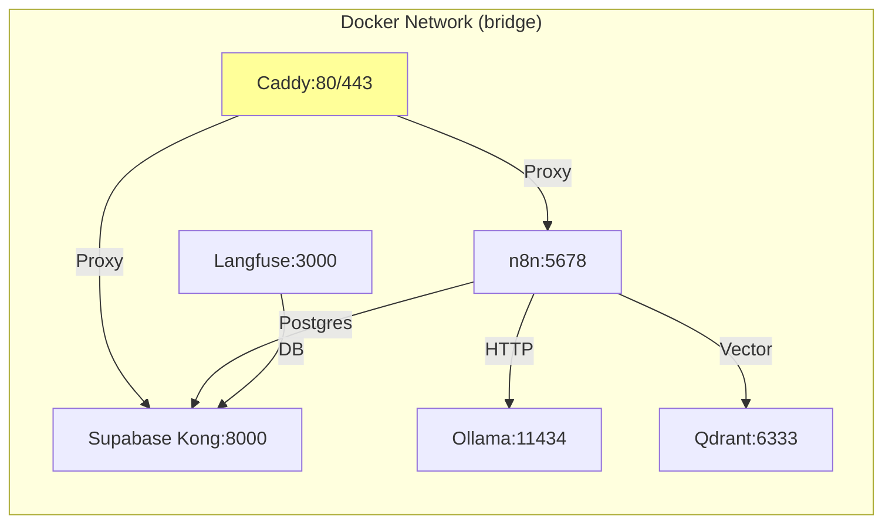
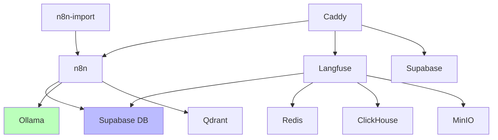

# Comprehensive Repository Documentation

## Table of Contents
- [Comprehensive Repository Documentation](#comprehensive-repository-documentation)
  - [Table of Contents](#table-of-contents)
  - [Overview](#overview)
  - [Repository Structure](#repository-structure)
  - [Technology Stack](#technology-stack)
  - [Architecture](#architecture)
  - [Processes and Procedures](#processes-and-procedures)
    - [Installation and Setup](#installation-and-setup)
    - [Service Deployment](#service-deployment)
    - [RAG AI Agent Workflow](#rag-ai-agent-workflow)
    - [Configuration Management](#configuration-management)
    - [Port Management](#port-management)
  - [Services and Components](#services-and-components)
    - [Core Services](#core-services)
    - [Supabase Stack](#supabase-stack)
    - [AI and Workflow Services](#ai-and-workflow-services)
    - [Observability and Utilities](#observability-and-utilities)
  - [Docker Configuration](#docker-configuration)
    - [Docker Compose Files](#docker-compose-files)
    - [Volumes and Networks](#volumes-and-networks)
    - [Container Orchestration](#container-orchestration)
  - [Diagrams](#diagrams)
    - [High-Level Architecture](#high-level-architecture)
    - [RAG Workflow Sequence](#rag-workflow-sequence)
    - [Docker Network Topology](#docker-network-topology)
    - [Service Dependencies](#service-dependencies)
  - [Additional Coverage](#additional-coverage)
    - [Ancillary Files](#ancillary-files)
    - [Security Considerations](#security-considerations)
    - [Potential Improvements](#potential-improvements)
  - [Changelog](#changelog)
  - [Indexes](#indexes)

## Overview
The "local-ai-packaged" repository is a self-hosted AI development environment designed for building local Retrieval-Augmented Generation (RAG) AI agents. It provides a complete stack for low-code AI workflow automation using n8n, integrated with Supabase for database and authentication, Ollama for local LLMs, and supporting services like vector databases (Qdrant, PGVector), graph databases (Neo4j), search engines (SearxNG), and observability tools (Langfuse). The setup emphasizes privacy, offline operation, and ease of use for developers building AI agents without cloud dependencies.

Key features:
- **Local RAG AI Agents**: Agentic workflows that handle document ingestion, vector storage, and intelligent querying across text and tabular data.
- **Multi-Service Orchestration**: Docker Compose-managed stack with GPU/CPU profiles and public/private environment support.
- **Extensible Tools**: n8n workflows for Google Drive integration, Postgres querying, and custom AI tools.
- **Configuration Automation**: Python scripts for service, port, and config management.

The repository is curated from the original n8n self-hosted AI starter kit with enhancements including Supabase, Open WebUI, Flowise, Neo4j, Langfuse, and Caddy reverse proxy. It supports development of AI agents for tasks like document analysis, knowledge base querying, and workflow automation.

**Target Users**: Developers, AI researchers, and teams building privacy-focused AI applications.

**License**: Apache License 2.0 (see [`LICENSE`](LICENSE)).

## Repository Structure
The project is organized into directories for core configurations, services, and utilities:

- **Root Level**:
  - [`docker-compose.yml`](docker-compose.yml): Main orchestration file including extensions and Supabase.
  - [`start_services.py`](start_services.py): Python script to orchestrate Supabase and AI services startup.
  - [`service-manager.py`](service-manager.py): Manages Docker service status, health, and operations.
  - [`config-manager.py`](config-manager.py): Evaluates and sets up configuration storage.
  - [`port-manager.py`](port-manager.py): Detects and resolves port conflicts.
  - [`.env.example`](.env.example): Template for environment variables (secrets, ports, hostnames).
  - [`README.md`](README.md): Project overview, installation, and troubleshooting.
  - [`Caddyfile`](Caddyfile): Reverse proxy configuration for services.
  - Override files: [`docker-compose.override.private.yml`](docker-compose.override.private.yml), [`docker-compose.override.public.yml`](docker-compose.override.public.yml).

- **supabase/**: Submodule for self-hosted Supabase (Postgres-based backend).
  - [`docker/docker-compose.yml`](supabase/docker/docker-compose.yml): Supabase-specific services (kong, auth, db, etc.).
  - Init scripts: [`volumes/db/*.sql`](supabase/docker/volumes/db/*.sql) for database setup.
  - Functions: [`volumes/functions/*.ts`](supabase/docker/volumes/functions/*.ts).

- **n8n/**: Workflow automation.
  - [`backup/workflows/*.json`](n8n/backup/workflows/*.json): RAG AI agent versions (V1-V3).
  - [`n8n-tool-workflows/*.json`](n8n-tool-workflows/*.json): Utility workflows (Google Doc creation, Postgres table listing).

- **flowise/**: Low-code AI builder.
  - Custom tools: [`*.json`](flowise/*.json) for Slack integration, Postgres queries, Google Docs.

- **reports/**: Python utilities.
  - [`docker_status.py`](reports/docker_status.py): Docker monitoring.
  - [`yaml_validate.py`](reports/yaml_validate.py): YAML validation.

- **searxng/**: Privacy-focused search.
  - [`settings-base.yml`](searxng/settings-base.yml): Search engine configuration.

- **assets/**: Media (e.g., [`n8n-demo.gif`](assets/n8n-demo.gif)).

- **Other**: Shell scripts (e.g., [`fix-supabase-env.sh`](fix-supabase-env.sh) for secret generation), monitoring ([`prometheus.yml`](prometheus.yml)).

Total files: ~100, primarily YAML/JSON configs, Python scripts, and n8n workflows. No CI/CD pipelines or Terraform IaC; Docker Compose serves as primary infrastructure definition.

## Technology Stack
- **Orchestration**: Docker Compose (v2+), Python 3.x (management scripts).
- **Backend/Database**: Supabase (Postgres 15+, pgvector extension), Qdrant (vector DB), Neo4j (graph DB), Valkey/Redis (caching), MinIO (S3-compatible storage), ClickHouse (analytics).
- **AI/ML**: Ollama (local LLMs: Qwen2.5, Nomic-Embed), Langfuse (LLM observability).
- **Workflow/Automation**: n8n (low-code), Flowise (AI agents).
- **Frontend/UI**: Open WebUI (chat interface), Supabase Studio (dashboard), Grafana/Prometheus (monitoring, partial).
- **Networking/Proxy**: Caddy (HTTPS reverse proxy), Kong (API gateway in Supabase).
- **Search**: SearxNG (metasearch engine).
- **Utilities**: Python (psutil, yaml, requests), shell scripts (secret generation).
- **Integrations**: Google Drive API, Slack (via n8n), SMTP (email auth).

Dependencies managed via Docker images; no package managers like npm/pip in root (Supabase uses pnpm).

## Architecture
The system follows a layered architecture:

1. **Presentation Layer**: Web UIs (n8n:5678, Open WebUI:3000, Flowise:3001, Supabase Studio via proxy).
2. **Application Layer**: n8n/Flowise for workflows, Ollama for inference, Langfuse for tracing.
3. **Data Layer**: Supabase (auth/API/DB/storage), Qdrant/Neo4j for vectors/graphs, PGVector for RAG.
4. **Infrastructure Layer**: Docker containers, Caddy proxy, volumes for persistence.

Communication: Internal Docker network (default bridge); HTTP/gRPC between services; Postgres connections for DB ops. External access via Caddy on ports 80/443 (public) or localhost ports (private).

Data Flow: Documents → File Trigger → Ingestion (chunk/embed/store in PGVector) → Agent Query (RAG/SQL tools) → LLM Response.

## Processes and Procedures

### Installation and Setup
**Prerequisites**: Docker/Docker Desktop, Python 3, Git.

**Step-by-Step**:
1. Clone: `git clone -b stable https://github.com/coleam00/local-ai-packaged.git && cd local-ai-packaged`.
2. Copy `.env.example` to `.env`.
3. Generate secrets: `./fix-supabase-env.sh` (populates JWT, Postgres password, etc.).
4. For production: Set hostnames in `.env` (e.g., `N8N_HOSTNAME=n8n.example.com`), email for Let's Encrypt.
5. Start: `python start_services.py --profile cpu --environment private` (options: cpu/gpu-nvidia/gpu-amd/none; private/public).

**Inputs/Outputs**: `.env` (inputs: secrets/ports); Outputs: Running containers, accessible UIs.
**Error Handling**: Script checks Supabase clone/pull, handles first-run SearxNG perms; Troubleshooting in README (e.g., delete db/data for password changes).
**Best Practices**: Use strong secrets; Backup `.env`; Monitor logs via `docker compose logs`.

### Service Deployment
**Workflow**: Managed by [`start_services.py`](start_services.py).
1. Clone/update Supabase submodule.
2. Copy `.env` to Supabase docker dir.
3. Stop existing containers (project: localai).
4. Start Supabase (`docker compose -f supabase/docker/docker-compose.yml up -d`).
5. Wait 10s for init.
6. Start AI stack (`docker compose -f docker-compose.yml -f override.yml up -d`).
7. Generate SearxNG secret in settings.yml.

**Prerequisites**: Docker running; GPU setup for nvidia/amd profiles.
**Inputs**: Profile (cpu/gpu), environment (private/public); Outputs: Unified localai project containers.
**Error Handling**: Timeout on commands; Fallbacks for platform-specific sed/openssl.
**Best Practices**: Use `--environment public` for cloud (closes non-80/443 ports); Update via `docker compose pull && down/up`.

### RAG AI Agent Workflow
**Description**: [`V3_Local_Agentic_RAG_AI_Agent.json`](n8n/backup/workflows/V3_Local_Agentic_RAG_AI_Agent.json) implements agentic RAG for document querying.

**Ingestion Process**:
1. Local File Trigger watches `/data/shared` for new files (add/change).
2. Loop Over Items → Set File ID (extract path/title/type).
3. Delete old records (docs_pg, document_rows).
4. Switch on type (PDF/Excel/CSV/TXT) → Extract text/data.
5. For tabular: Aggregate → Summarize schema → Insert rows (JSONB in document_rows), Update metadata schema.
6. For text: Chunk (RecursiveCharacterTextSplitter:400) → Embed (Nomic-Embed) → Store in PGVector (documents_pg with metadata).

**Query Process**:
1. Webhook/Chat Trigger (POST /bf4dd093-... with chatInput/sessionId).
2. Edit Fields → RAG AI Agent (Ollama Qwen2.5 via OpenAI-compatible API).
3. Agent uses tools: List Documents (select from document_metadata), Get File Contents (string_agg from documents_pg), Query Document Rows (custom SQL on row_data JSONB).
4. System Prompt: Prioritize RAG, fallback to full doc/SQL for tabular/numeric.
5. Respond to Webhook.

**Prerequisites**: PGVector extension in Supabase; Ollama models pulled (qwen2.5:7b, nomic-embed-text).
**Inputs**: File paths (ingestion), chat queries (JSON: {chatInput, sessionId}); Outputs: Processed embeddings, agent responses.
**Error Handling**: Fallback output in Switch; Postgres error on invalid SQL.
**Best Practices**: Run table creation nodes once (document_metadata, document_rows); Use shared volume for files; Tune chunk size for docs.

### Configuration Management
**Tool**: [`config-manager.py`](config-manager.py) evaluates storage options.

**Process**:
1. Evaluate Supabase DB vs Files (scores: performance/reliability/etc.).
2. Recommend (typically Files for simplicity).
3. Initialize: Create ./config/services.json with defaults (global_settings, services).
4. Update: `update_service_config(service, config)` → Backup → Save JSON.

**Example**: Configures supabase-db (port:5432), n8n (port:5678, deps:['postgres']).

**Prerequisites**: Python (yaml/json); Optional: Supabase for DB mode.
**Inputs**: Service name/config dict; Outputs: services.json, backups.
**Error Handling**: Fallback empty dict on load fail.
**Best Practices**: Git-track configs; Validate schemas; Hot-reload in services.

### Port Management
**Tool**: [`port-manager.py`](port-manager.py) resolves Docker port conflicts.

**Process**:
1. Load ports from docker-compose.yml.
2. Check used ports (lsof/netstat fallback).
3. Detect conflicts (port in used_ports).
4. Find next available (socket bind test, start 8000+).
5. Generate override (docker-compose.override.ports.yml) with new ports.
6. Restart: `docker compose down && up -d`.

**Prerequisites**: lsof/netstat; yaml lib.
**Inputs**: Compose file; Outputs: Override YAML, mappings dict.
**Error Handling**: Warn on no available ports; Skip invalid configs.
**Best Practices**: Run before startup; Use private overrides for localhost binding.

## Services and Components

### Core Services
- **n8n** (image: n8nio/n8n:latest): Low-code workflow engine. Ports: 5678 (internal), 9003 (private). Env: DB=postgres (Supabase), webhook URL. Deps: n8n-import (workflows/credentials). Communication: HTTP to Ollama/Qdrant/Supabase; Scales: Single instance. Monitoring: Langfuse integration.
- **Ollama** (image: ollama/ollama:latest): Local LLM inference. Ports: 11434. Profiles: cpu/gpu-nvidia/gpu-amd (ROCm). Env: Context=8192, max models=2. Volumes: ollama_storage. Deps: None. Communication: HTTP API. Scaling: GPU-accelerated; Pull init models (qwen2.5:7b, nomic-embed).
- **Supabase** (included compose): Full backend stack. See [Supabase Stack](#supabase-stack). Proxy via Caddy:8005.
- **Caddy** (image: caddy:2-alpine): Reverse proxy. Ports: 80/443. Volumes: caddy-data/config. Env: Hostnames (N8N_HOSTNAME etc.), Let's Encrypt email. Deps: All services. Communication: Upstream to service ports. Scaling: Single; Security: Auto-TLS.

### Supabase Stack
Catalog from [`supabase/docker/docker-compose.yml`](supabase/docker/docker-compose.yml):
- **studio** (supabase/studio): Dashboard. Port: 3000 (proxied). Deps: analytics. Env: SUPABASE_URL/KEYS. Health: API profile fetch.
- **kong** (kong:2.8.1): API gateway. Ports: 8000/8443. Volumes: kong.yml. Env: Plugins (auth/cors). Deps: analytics. Communication: Upstream to auth/rest/etc.
- **auth** (supabase/gotrue): Authentication. Port: 9999. Deps: db/analytics. Env: JWT_SECRET, SMTP. Health: /health. Scaling: Session-based.
- **rest** (postgrest): REST API. Port: 3000. Deps: db. Env: PGRST_DB_URI/SCHEMAS. Command: postgrest.
- **realtime** (supabase/realtime): WebSockets. Port: 4000. Deps: db. Env: DB_ENC_KEY, JWT. Health: /api/tenants/health.
- **storage** (supabase/storage-api): File storage. Port: 5000. Volumes: storage. Deps: db/rest/imgproxy. Env: FILE_STORAGE_BACKEND=file. Health: /status.
- **imgproxy** (darthsim/imgproxy): Image processing. Port: 5001. Volumes: storage. Health: imgproxy health.
- **meta** (supabase/postgres-meta): DB management. Port: 8080. Deps: db. Env: PG_META_DB_*.
- **functions** (supabase/edge-runtime): Edge functions. Volumes: functions. Env: SUPABASE_DB_URL. Command: deno start.
- **analytics** (supabase/logflare): Logs/analytics. Port: 4000. Deps: db. Env: POSTGRES_BACKEND_URL. Health: /health.
- **db** (supabase/postgres:15): Postgres DB. Volumes: data, init SQLs (jwt/roles/logs/pooler/realtime/webhooks). Env: POSTGRES_PASSWORD. Health: pg_isready. Command: postgres with custom conf.
- **vector** (timberio/vector): Log shipping. Volumes: vector.yml, docker.sock. Health: /health.
- **supavisor** (supabase/supavisor): Connection pooler. Ports: 5432/6543. Volumes: pooler.exs. Deps: db. Env: DATABASE_URL, POOLER_*. Health: /api/health.

**Inter-Service**: Kong routes to auth/rest/storage; All use shared DB; Realtime subscribes to DB changes.

### AI and Workflow Services
- **flowise** (flowiseai/flowise): AI agent builder. Port: 3001. Env: FLOWISE_USERNAME/PASSWORD. Volumes: ~/.flowise. Entry: sleep then start.
- **open-webui** (ghcr.io/open-webui/open-webui:main): Chat UI. Port: 8080. Volumes: open-webui data. Extra hosts: host.docker.internal.
- **qdrant** (qdrant/qdrant): Vector DB. Ports: 6333/6334. Volumes: qdrant_storage.
- **neo4j** (neo4j:latest): Graph DB. Ports: 7473/7474/7687. Volumes: logs/config/data/plugins. Env: NEO4J_AUTH.
- **n8n-import** (n8n:latest): Imports workflows/credentials. Volumes: ./n8n/backup. Command: import from /backup. One-time.

### Observability and Utilities
- **langfuse-web/worker** (langfuse/langfuse:3): LLM tracing. Ports: 3000/3030. Deps: postgres/minio/redis/clickhouse. Env: DATABASE_URL, S3_*, CLICKHOUSE_*.
- **searxng** (searxng/searxng:latest): Search. Port: 8080. Volumes: ./searxng. Env: SEARXNG_BASE_URL, UWSGI_*.
- **Support Services**: postgres (langfuse), redis/valkey, minio, clickhouse (langfuse stack).

**Communication**: HTTP/REST (Caddy proxy), DB connections (Postgres URI), Message queues (none explicit), gRPC (Ollama/Realtime possible).

**Scaling**: Single-container per service; Horizontal via Docker Swarm (not configured); Resource limits in compose (e.g., Ollama GPU res).

**Monitoring/Logging**: Langfuse for AI traces; Docker logs (json-file, 1m max); Partial Prometheus (n8n/localai/rabbitmq).

## Docker Configuration

### Docker Compose Files
- **Main** ([`docker-compose.yml`](docker-compose.yml)): Includes extensions.yml and supabase/docker/docker-compose.yml. Defines volumes (n8n_storage, ollama_storage, etc.), anchors (x-n8n, x-ollama), services (flowise, open-webui, n8n, qdrant, neo4j, caddy, langfuse stack, searxng, ollama profiles). Profiles: cpu/gpu-nvidia/gpu-amd. Healthchecks: wget/pg_isready/redis-cli. Caps: Drop ALL, add NET_BIND_SERVICE.
- **Supabase** ([`supabase/docker/docker-compose.yml`](supabase/docker/docker-compose.yml)): 13 services (studio to supavisor). Multi-stage init via SQL volumes. Healthchecks for all. Volumes: db/data, functions, storage. Env heavy (JWT, SMTP, S3).
- **Overrides**:
  - [`docker-compose.override.private.yml`](docker-compose.override.private.yml): Binds all ports to 127.0.0.1:9001+ (private dev).
  - [`docker-compose.override.public.yml`](docker-compose.override.public.yml): Limits to 80/443 (prod).
  - Public Supabase variant for S3.

**Build Stages**: No multi-stage Dockerfiles in root; Supabase uses pre-built images. Optimizations: Alpine bases (caddy/searxng), expose only needed ports.

**Security Scans**: None automated; Manual via `docker scout` recommended. No vuln scans in scripts.

### Volumes and Networks
**Volumes** (persistent):
- n8n_storage, ollama_storage, qdrant_storage, open-webui, flowise (app data).
- caddy-data/config (TLS/certs).
- langfuse_postgres_data, langfuse_clickhouse_data/logs, langfuse_minio_data (observability).
- Supabase: db/data, storage, functions, logs/vector.yml.
- valkey-data (Redis).

**Networks**: Default Docker bridge (implicit). No custom networks; All services communicate via service names (e.g., n8n → db:5432).

**Persistence Strategies**: Named volumes for state; Bind mounts for configs/scripts (e.g., ./n8n/backup, ./searxng). Backup: Docker volume export or git for configs.

### Container Orchestration
**Build/Run**: `docker compose up -d --profile <profile>`. Init: n8n-import completes before n8n; Ollama-pull before ollama. Depends_on: Langfuse on DBs (healthy); Supabase db on vector.
**Runtime**: Restart: unless-stopped/always. Resource Limits: GPU res for ollama; Cap drops for security (caddy/searxng). Health: Interval 3-5s, retries 3-10.
**Management**: `service-manager.py` for status/start/stop/logs; `docker compose down -v` for cleanup.
**Scaling**: No replicas; Manual via compose scale (e.g., `docker compose up --scale n8n=2`).

## Diagrams

### High-Level Architecture
```mermaid
graph TB
    subgraph "External Access"
        C[Caddy Proxy<br/>80/443]
    end
    subgraph "AI Layer"
        N8N[n8n Workflows]
        OWUI[Open WebUI]
        FL[Flowise]
        OL[Ollama LLM]
    end
    subgraph "Data Layer"
        SB[Supabase<br/>(Auth/API/DB/Storage)]
        QD[Qdrant Vector]
        NJ[Neo4j Graph]
        LG[Langfuse Tracing]
    end
    subgraph "Infrastructure"
        PG[Postgres PGVector]
        R[Redis/Valkey]
        MI[MinIO S3]
        S[SearxNG Search]
    end
    C --> N8N
    C --> OWUI
    C --> FL
    C --> SB
    N8N --> OL
    N8N --> PG
    N8N --> QD
    N8N --> NJ
    N8N --> S
    OWUI --> OL
    FL --> OL
    SB --> PG
    LG --> N8N
    LG --> OL
    style C fill:#f9f,stroke:#333
    style PG fill:#bbf,stroke:#333
```

**Legend**: Solid arrows = HTTP/DB connections; Dashed = Optional (e.g., search).

### RAG Workflow Sequence


### Docker Network Topology


### Service Dependencies


**Version**: v1.0 (2025-09-10).

## Additional Coverage

### Ancillary Files
- **Environment**: [`.env`](.env) (secrets: POSTGRES_PASSWORD, JWT_SECRET, ANON_KEY); Backups (.env.backup.*).
- **Scripts**: [`deploy-legislative-ai.sh`](deploy-legislative-ai.sh) (cloud deploy?), [`fix-jwt-problem.sh`](fix-jwt-problem.sh) (JWT fixes).
- **n8n Tools**: [`Create_Google_Doc.json`](n8n-tool-workflows/Create_Google_Doc.json) (webhook → Google Drive create), [`Get_Postgres_Tables.json`](n8n-tool-workflows/Get_Postgres_Tables.json) (list public tables).
- **Reports**: [`docker_status.py`](reports/docker_status.py) (status checks), [`yaml_validate.py`](reports/yaml_validate.py) (config validation).
- **Other**: [`tasks.md`](tasks.md) (TODOs), [`errors.md`](errors.md) (common issues), [`extensions.yml`](extensions.yml) (Docker extensions), [`prometheus.yml`](prometheus.yml) (basic scraping), LICENSE, .gitignore.

No CI/CD (GitHub Actions in .github/ empty); IaC limited to Docker Compose (declarative services/volumes).

### Security Considerations
- **Secrets**: Use [`fix-supabase-env.sh`](fix-supabase-env.sh) for random generation; Avoid @ in passwords; Store .env securely (gitignore'd).
- **Proxy**: Caddy auto-TLS; Public env limits ports; Cap drops (ALL except NET_BIND_SERVICE).
- **DB**: Supabase roles/JWT; No exposed DB ports in public.
- **Containers**: Non-root users (e.g., clickhouse:101:101); Healthchecks prevent zombie services.
- **Vulns**: Update images (`docker compose pull`); Scan with Trivy/Clair; No secrets in images.
- **Access**: n8n/Flowise/OpenWebUI require local accounts; Supabase DASHBOARD_USERNAME/PASSWORD.

**Improvements**: Add secrets scanning (git-secrets); RBAC in n8n; Vault for dynamic secrets; OWASP scans.

### Potential Improvements
- **CI/CD**: Add GitHub Actions for image builds/tests/deploy (e.g., to Kubernetes).
- **Monitoring**: Full Prometheus/Grafana stack; Alerting on service health.
- **Scaling**: Docker Swarm/K8s manifests; Auto-scaling for n8n workers.
- **Backup**: Automated volume snapshots (e.g., via cron + docker volume backup).
- **Docs**: API refs for custom tools; Video walkthroughs.
- **Performance**: Ollama model quantization; PGVector indexing optimizations.
- **Security**: Add Falco for runtime security; Rotate secrets periodically.

## Changelog
- **v1.0 (2025-09-10)**: Initial comprehensive documentation. Covered all files/services; Added Mermaid diagrams.
- **Future**: Update post major releases (e.g., Supabase v2, n8n updates).

## Indexes
**Services Index**:
- n8n: [Processes](#service-deployment), Ports 5678
- Supabase: [Stack](#supabase-stack), Proxy 8005
- Ollama: [AI Services](#ai-and-workflow-services), 11434

**Files Index**:
- [`docker-compose.yml`](docker-compose.yml): Line 58 (services start)
- [`V3_Local_Agentic_RAG_AI_Agent.json`](n8n/backup/workflows/V3_Local_Agentic_RAG_AI_Agent.json): Line 278 (agent prompt)

**Cross-References**: See [RAG Workflow](#rag-ai-agent-workflow) for n8n details; [Docker](#docker-configuration) for volumes.

---
*Generated by Sonoma Documentation Writer. Last Updated: 2025-09-10.*